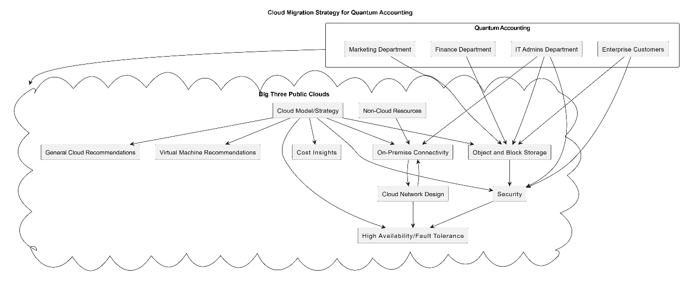

# Cloud-migration-strategy-using-public-cloud-solution.

<b>Background</b>

One of our clients have decided to revisit a potential migration of their infrastructure to a Public Cloud solution.
Previously there was confusion around ‘ownership’ in the cloud. People were unsure around what was their responsibility and what was offered by cloud providers. The staff were confused about the terms ‘managed and unmanaged’.
The Marketing and Finance departments are very interested in the storage aspects of public cloud offerings. Also, the IT Admins department would be interested in whether it can help with backup and availability.
Enterprise customers’ data (companies of more than 5,000 employees) must be retained for a minimum of 15 years and available for annual auditing.

<b>The task</b>

I and the team were tasked with investigating whether it would be appropriate to migrate the business’ infrastructure to one or more of the big three public cloud providers.
They wanted the design to include:

•	The appropriate cloud model/strategy. 
•	Cloud network design. 
•	Virtual machine recommendations. 
•	Storage – both object and block based. 
•	Cost insights. 
•	Security, including:  
&nbsp;&nbsp;o	RBAC and/or IAM permissions. 
&nbsp;&nbsp;o	Data encryption at rest and in transit. 
&nbsp;&nbsp;o	Responsibility. 
•	On premise connectivity to the cloud (if appropriate). 
•	High availability and/or fault tolerance. 
•	Any resources that are NOT ‘cloud candidates’. 
•	Any general cloud recommendations you feel are appropriate. 
Our client is a financial organisation who must always consider security, GDPR and where customer data is located. 
<b></b>My Solution:</b> 

